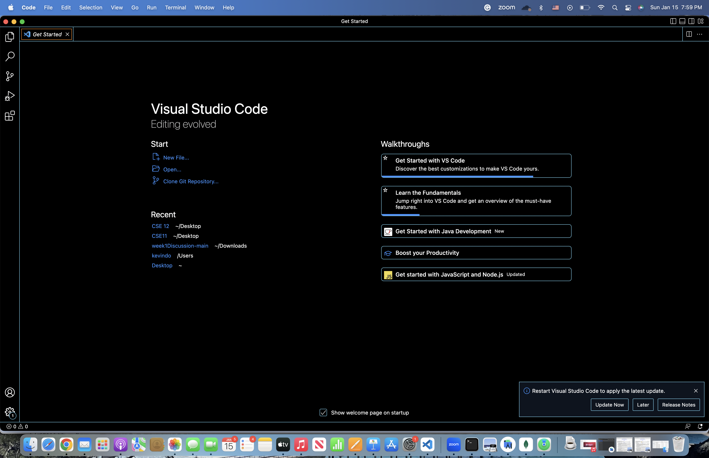
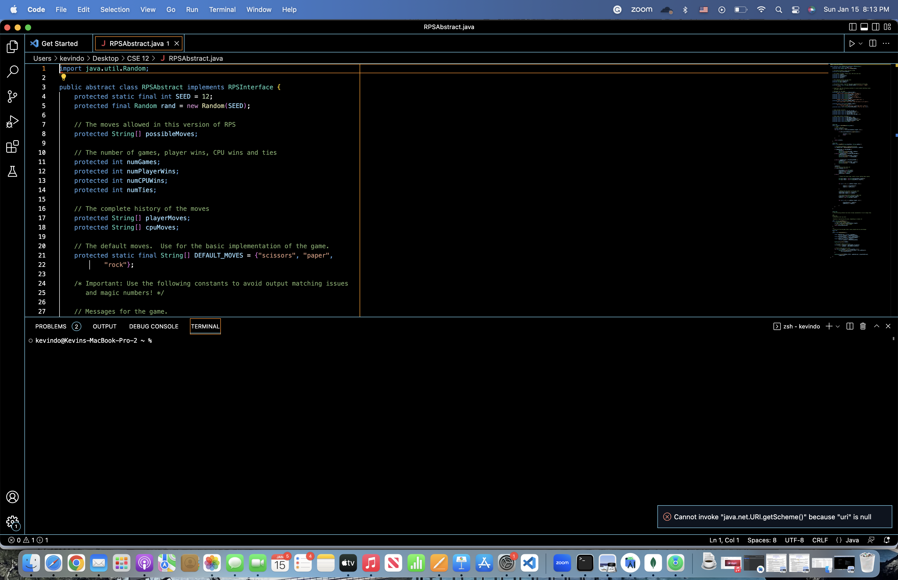
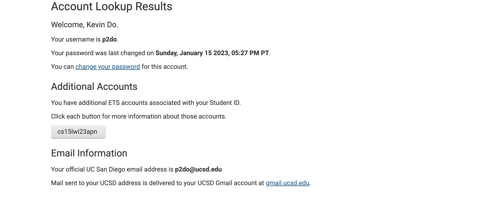
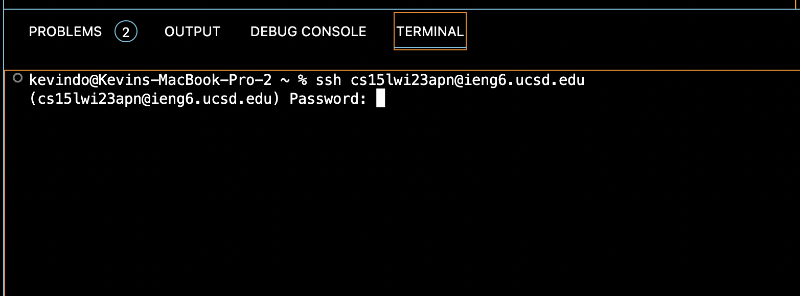
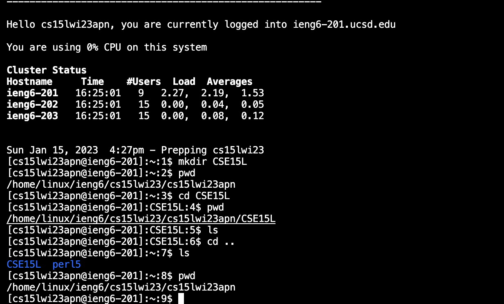

# LAB 1 REPORT

In this lab, I will show you the steps needed to log into a course-specific account on ieng6.

# 1) INSTALL AND GET VSCODE WORKING 

First, you need to install VSCode, a very easy to use integrated development environment (IDE). This is the [link](https://code.visualstudio.com/) that I used to download VSCode.
After downloading and opening VSCode, you need to access exisitng files/folders or createing new ones. Since I already downloaded VSCode for a class 
last quarter, I did not need to reinstall it. Here is a screenshot of what my VSCode looks like when I open it:

Here is what it looks like when I access an existing file on my computer: 

We will be entering commands in the terminal at the bottom of the screen.

# 2) REMOTELY CONNECTING 

Before entering any commands in the terminal, if you are using Window, make sure to download *Git* first with this [link](https://gitforwindows.org/).
Now use this [tutorial](https://stackoverflow.com/questions/42606837/how-do-i-use-bash-on-windows-from-the-visual-studio-code-integrated-terminal/50527994#50527994) to learn how to use the newly installed git-bash in VSCode. If you are using a Mac, the previous steps need not to be taken.

Next, use this [link](https://sdacs.ucsd.edu/~icc/index.php) to access your CSE15L account. After logging in using your username and PID, you should see your account's ID in a box like this: 

Now, change the password of your CSE15L account using this [tutorial](https://docs.google.com/document/d/1hs7CyQeh-MdUfM9uv99i8tqfneos6Y8bDU0uhn1wqho/edit)

After that, using the terminal in VSCode, enter the following command but replaced the xxx with the specific letters in your account's ID: 
`$ ssh cs15lwi23xxx@ieng6.ucsd.edu` 
For instance, I will replace xxx with apn since those 3 letters are my account's ID unique letters:
`$ ssh cs15lwi23apn@ieng6.ucsd.edu`

After this, you will probably get a message that begins with *The authenticity of host 'ieng6.ucsd.edu (128.54.70.227)' can't be established...* since it
is your first time attempting to connect to the server. At the end of the message it will ask you *Are you sure you want to continue connecting (yes/no/[fingerprint])?* Go ahead and type *yes* into the terminal. After doing that, the terminal will ask you to enter your newly generated password.
Here is what it should look like:

Go ahead and enter your the password you just changed your account to. In the tutorial, it mentioned that your account will take up to 15 minutes to be updated with the new password. This is not always true, as for my case, it took over 1 hour and only started working at the end of my lab section. If it doesn't work, try changing up the password again and re-try. 

If you are able to log in successfully, your terminal should look somewhat like this: 

Now you are ready for trying out some commands!

