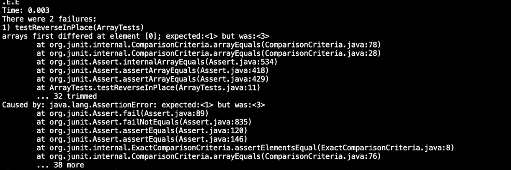

# LAB 2 REPORT

In this report, I will be showing how I implemented a web server called StringServer--which tracks String added by incoming requests and prints them onto 
the front page of the web server--and my analysis of a buggy program using Junit testing.

# PART 1 
 
Below is my code for the StringServer web server 

```import java.io.IOException;
import java.net.URI;

class Handler implements URLHandler {
    // The one bit of state on the server: a number that will be manipulated by
    // various requests.
    String returnString = "";

    public String handleRequest(URI url) {
        if (url.getPath().equals("/")) {
            return String.format(returnString);
        } else {
            System.out.println("Path: " + url.getPath());
            if (url.getPath().contains("/add-message")) {
                String[] parameters = url.getQuery().split("=");
                
                returnString += parameters[1]+ "\n";
                return String.format(returnString);
                
            }
            return "404 Not Found!";
        }
    }
}

class StringServer {
    public static void main(String[] args) throws IOException {
        if(args.length == 0){
            System.out.println("Missing port number! Try any number between 1024 to 49151");
            return;
        }

        int port = Integer.parseInt(args[0]);

        Server.start(port, new Handler());
    }
}
```

There are two parts to my code: Handler Class and StringServer class:

The Handler class has two if statement. If the url only has "/" then it accesses the path of the URL and return the current string. Otherwise, it would execute the else statement. This else clause states that if there is an `/add-message` command in the path, then the program should concatenate the string behind the "=" sign to the current string. Note that each string will be printed on its own line when on the web server.

The StringServer class' main point is to set the port number that should be entered in when the class is called in the terminal, and launch a webserver with the port number. For instance, when we run java NumberServer 4000, the program starts a web server at port 4000 that the local host connects to.

Here are my examples of using `/add-message`:


In this example, I created a web server with port 4002. In the terminal, when I compile using `javac Server.java StringServer.java` and run immediately after using `java StringServer 4002`, the main method in the StringServer class was called and a web server that is connected to the local host with port 4002 was created. For this exmaple, when I used `/add-message,` the else clause of the if statement of the handleRequest method in the Handler class was called, causing the String "Today is a wet day" after `/add-message`, to be added into the String 'returnString'. 


Similarly, in this instance, I created a web server with port 5002. Running the `javac Server.java StringServer.java` and `java StringServer 5002` commands in the terminal in order, the main method in the StrinServer class was called, which in turn launches a new webserver that connects to the local host with port 5002. When I added the string "Happy" using `add-message` the handleRequest method was called again, allowing the string `returnString` to append "Happy."


# PART 2
This Junit test implementation shows an example of a failure inducing input for the buggy program 

```
import static org.junit.Assert.*;
import org.junit.*;

public class ArrayTests {
	@Test 
	public void testReverseInPlace() {
    int[] input1 = { 3 };
    int [] input2 = {3,2,1};

 
    ArrayExamples.reverseInPlace(input1);
    ArrayExamples.reverseInPlace(input2);

    //failed
    assertArrayEquals(new int[]{1,2,3}, input2);

	}
}
```


This Junit test implementation shows the same program from above, but now the input for the test is not inducing any failure (this example was provided by the TAs/tutors): 

```
import static org.junit.Assert.*;
import org.junit.*;

public class ArrayTests {
	@Test 
	public void testReverseInPlace() {
    int[] input1 = { 3 };
    int [] input2 = {3,2,1};

 
    ArrayExamples.reverseInPlace(input1);
    ArrayExamples.reverseInPlace(input2);

    //passed
    assertArrayEquals(new int[]{ 3 }, input1);
  }
}
```
When running the two tests above in one, the one that fails will produce the following output:


In order to pass the test case that fails, I changed up the code to account for the error. Below are 2 snippets of code: before vs after. The before code was provided by the CSE 15L TAs/tutors.

***BEFORE:***
```
  static void reverseInPlace(int[] arr) {
    for(int i = 0; i < arr.length; i += 1) {
      arr[i] = arr[arr.length - i - 1];
    }
  }
```

***After***
```
 static void reverseInPlace(int[] arr) {
    int [] tempArr = new int [arr.length];
    for (int i = 0; i < arr.length; i++){
      tempArr[i] = arr[arr.length - i - 1];
    }
    for(int i = 0; i < arr.length; i++) {
      arr[i] = tempArr[i];
    }

  }
```
To account for the bug, I made a temporary array and copy everything in reverse order from original array to temp array and after that, re update the original array. In the original code, the for loop makes it so that the indices overlap and does not produce our desired result.

# PART 3
Through the labs of week 2 and week 3, I learned how to deploy a website that connects to my computer using URLHandler. Before I did not know that I can create a website of my own from my computer, and that I have to use some kind of external services for that.


