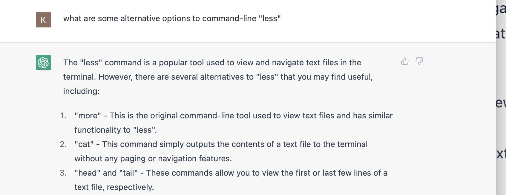

# LAB 3 REPORT

In this lab, I will show you the alternative terminal commands to `less`.

Through the use of chatGPT, I was able to obtain 4 other terminal command alternatives, including: `cat`, `head`, `tail`, and `more`.

Here is an image of my usage of [chatGPT created by openAI](https://openai.com/blog/chatgpt/): 

# GENERAL DESCRIPTION OF LESS AND HOW IT WORKS
less is a command 

# 1) CAT

# 2) HEAD

# 3) TAIL

# 4) MORE

