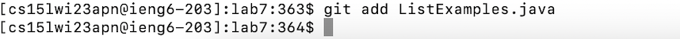

# LAB REPORT 4

In this report, I will be reporting on how I followed the baseline steps as listed on CSE 15L's github page. 

Before all of the steps listed below, I already made sure to removed any fork I made of the repository. 

# PART 1 - ssh into remote account


Here I logged into my remote server account using `ssh cs15lwi23apn@ieng6.ucsd.edu`. I do not have to use password anymore since I already followed 
the instructions listed on the page to create a key and attach it to my github account.


# PART 2 - clone the lab7 repo 

Here is an image of me using `git clone` to clone into the repo of lab7. After cloing I immediately cd into it using `cd lab7`


# PART 3 - running the JUnit tests

I then used `ls` to see which files are contained within lab7 and then memorized the name of the file I need to test and also the tester file. After that, I began running the JUnit Tests on the ListExampleTests Files. I used the following commands:
```
javac -cp .:lib/hamcrest-core-1.3.jar:lib/junit-4.13.2.jar *.java
java -cp .:lib/hamcrest-core-1.3.jar:lib/junit-4.13.2.jar org.junit.runner.JUnitCore ListExamplesTests

```
It showed errors as expected:


# PART 4 - editing the ListExamples.java file

After this I ran `nano ListExamples` to access the content of the file, I then made changes to the file. I found 2 errors within this file and fixed them. I then pressed `CTRL+X` to exit and when exiting I pressed `Y` to save all the changes and then pressed `enter` to acctually exit out.

Here is a picture of the file after being edited:


The highlighted parts are where I made changes


# PART 5 - rerun the JUnit Tests

For this part, I just pressed the key `<up><up><up>` to re run the compiler. I then pressed `<up><up><up>` again to run the JUnit test on ListExamplesTests.java 

The picture below shows my tests passing:


# PART 6 - commit 
 
 In order to commit I had to run `git commit ListExamples.java,` then a screen will pop up where I have to write a commit message. After finish writing, 
 I pressed in order : `<esc><:><wq><enter>` to exit the screen. 
 
 The picture below shows what the screen that popped up looks like and what I wrote for my commit message:
 
 
 # PART 7 - add
 
 I then add the commited changes by running:
 `git add ListExamples.java`
 
 

 


